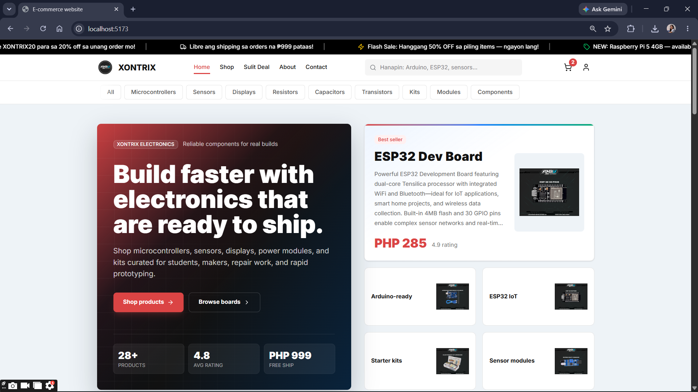
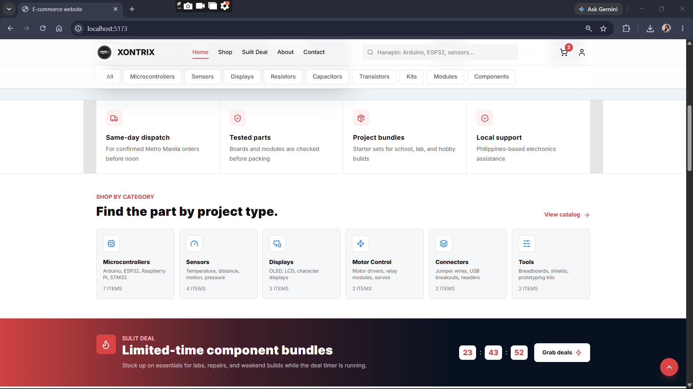
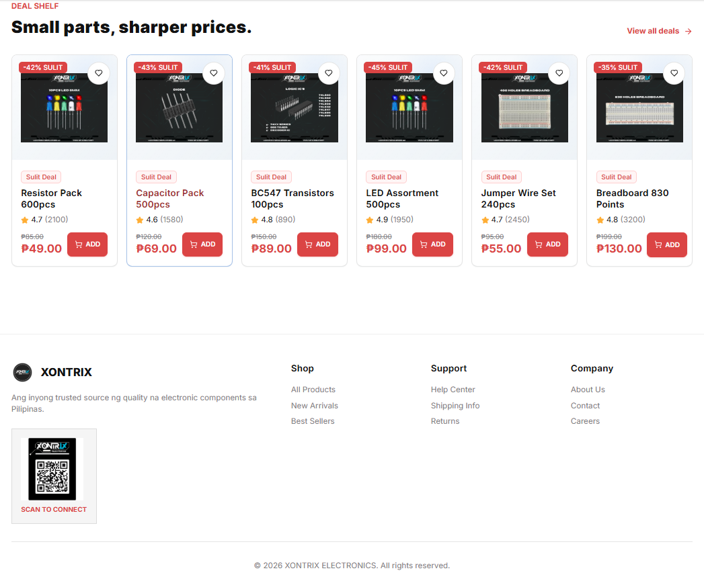
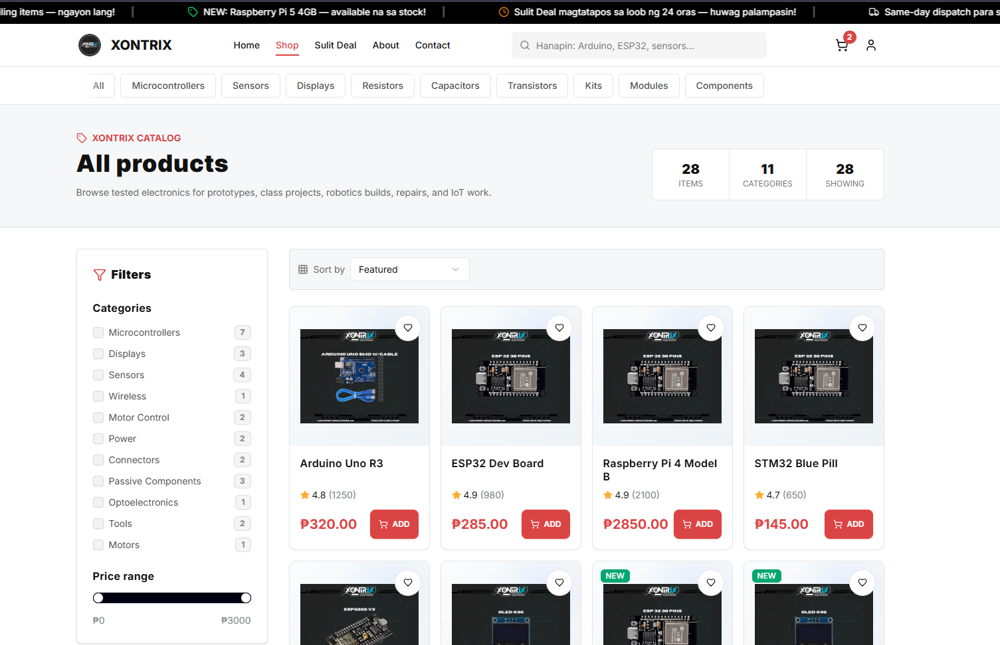
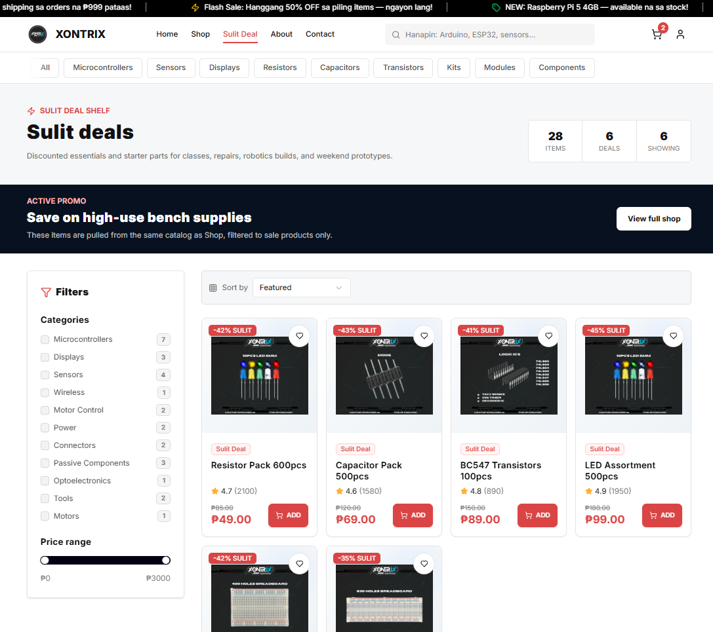
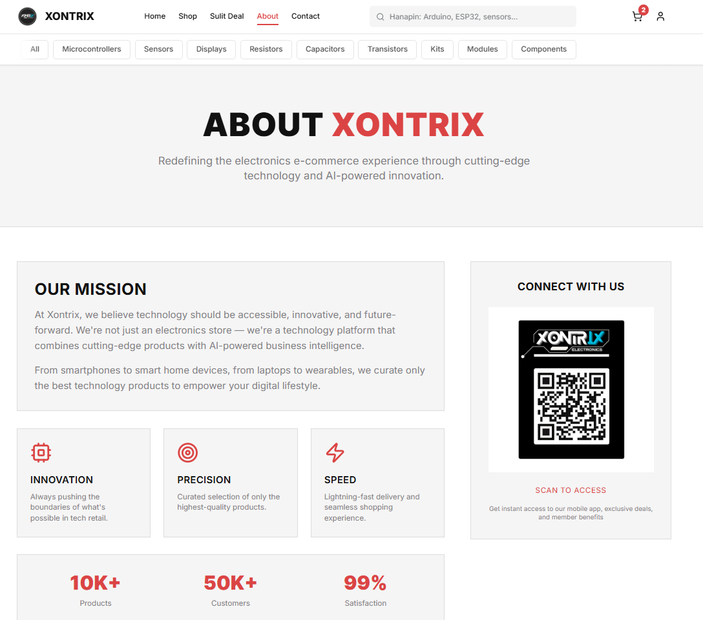
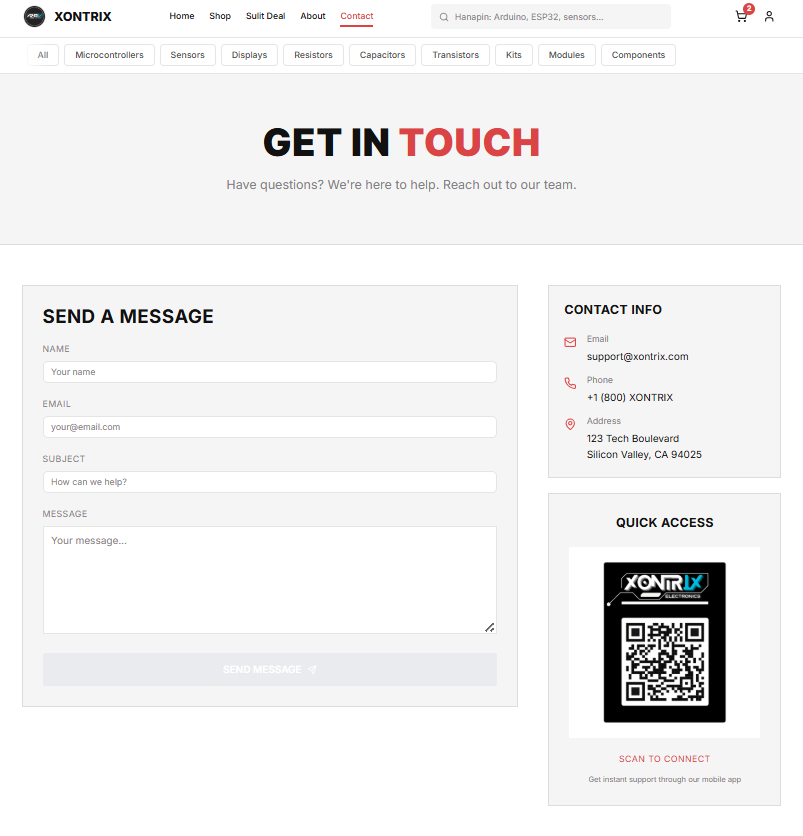
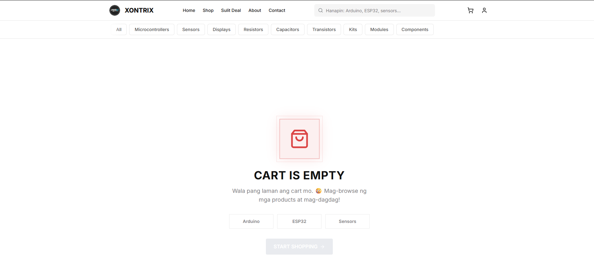
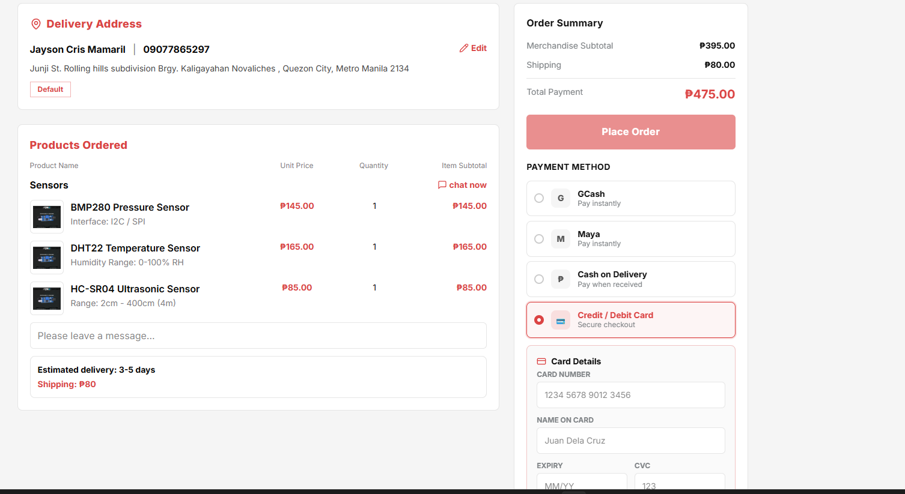

<p align="center">
  
</p>

<h1 align="center">🛒 Xontrix</h1>

<p align="center">
  <strong>Integrated Electronics E-Commerce & AI-Powered Business Management Platform</strong>
</p>

<p align="center">
  Electronics e-commerce for components & kits, backed by a simple PHP/MySQL API, and designed to be extended with AI/insights.
</p>

<p align="center">
  
  
  
  
  
  
  
</p>

<p align="center">
  <a href="#-quick-start">Quick Start</a> •
  <a href="#-highlights">Highlights</a> •
  <a href="#️-architecture">Architecture</a> •
  <a href="#-routes--pages">Routes</a> •
  <a href="#-project-structure">Project Structure</a> •
  <a href="#-build-for-production">Build</a> •
  <a href="#-roadmap">Roadmap</a>
</p>

---

## ✨ Highlights

- **Electronics product catalog** with product detail pages
- **Cart + Checkout UI** (client-side experience)
- **Admin/Dashboard pages** backed by authenticated API endpoints
- **Backend-driven data** via a PHP/MySQL REST-like API (`xontrix-backend`)
- **shadcn/ui** powered interface components
- **Responsive layout** with Tailwind CSS

---

## 🏗️ Architecture

This repository is structured as a monorepo containing:

### Frontend (React + Vite)
- **Location**: `apps/web/src/`
- **Dev Server**: `pnpm dev` (Vite dev server)
- **API Client**: `apps/web/src/app/lib/api.ts`

### Backend (PHP + MySQL)
- **Location**: `apps/backend/xontrix-backend/`
- **Server**: Apache (e.g., XAMPP)
- **Install & Schema**: `apps/backend/xontrix-backend/api/install.php`, `apps/backend/xontrix-backend/api/schema.sql`

---

## 🚀 Quick Start

### 1️⃣ Run the PHP/MySQL Backend (XAMPP)

Follow `apps/backend/xontrix-backend/README.md`:

1. Copy `apps/backend/xontrix-backend` into:
   ```
   C:\xampp\htdocs\xontrix-backend
   ```

2. Start Apache + MySQL in XAMPP.

3. Open once to install schema + seed data:
   ```
   http://localhost/xontrix-backend/api/install.php
   ```

4. Login with default seeded account:
   ```
   Email: admin@xontrix.local
   Password: admin123
   ```

### 2️⃣ Configure Frontend API Base URL

The frontend API client uses `apps/web/src/app/lib/api.ts` with:
```
BASE_URL = import.meta.env.VITE_API_URL ?? 'http://localhost/xontrix-backend/api'
```

Add a `.env` file at the project root or under `apps/web/`:
```bash
VITE_API_URL=http://localhost/xontrix-backend/api
```

> If you host the backend under a different folder/port, update `VITE_API_URL`.

### 3️⃣ Start the Frontend

```bash
pnpm install
pnpm dev
```

**Dev server**: http://localhost:5173

---

## 🔧 Frontend Configuration

### Firebase

This app already includes Google sign-in via Firebase. To enable it:

1. Copy `apps/web/.env.example` to `apps/web/.env`.
2. Create a Firebase project in the Firebase Console.
3. Add a Web app and enable Google authentication in Firebase Authentication.
4. Paste the generated Firebase config values into `apps/web/.env`.

Example keys you must fill in:

- `VITE_FIREBASE_API_KEY`


- `VITE_FIREBASE_AUTH_DOMAIN`
- `VITE_FIREBASE_PROJECT_ID`
- `VITE_FIREBASE_STORAGE_BUCKET`
- `VITE_FIREBASE_MESSAGING_SENDER_ID`
- `VITE_FIREBASE_APP_ID`

Once configured, the login page will use Firebase's `signInWithPopup()` flow and then call the backend `users.php?action=google` endpoint.

If any Firebase config value is missing or blank, `isFirebaseConfigured` in `apps/web/src/app/lib/firebase.ts` becomes `false` and the Google button stays disabled.

---

## 🗺️ Routes & Pages

Available routes in the UI:


| Route | Description |
|:------|:------------|
| `/` | Home page |
| `/products` | Product catalog |
| `/products/:id` | Product detail |
| `/cart` | Shopping cart |
| `/checkout` | Checkout flow |
| `/dashboard` | Dashboard (admin area) |
| `/admin` | Admin panel |
| `/login` | Login page |
| `/about` | About page |
| `/contact` | Contact page |
| `*` | 404 Not Found |

---

## 📁 Project Structure

```
.
├── package.json               # Root dependencies & workspace scripts
├── pnpm-workspace.yaml        # pnpm workspace configuration
├── pnpm-lock.yaml             # pnpm lockfile
├── apps/
│   ├── web/                   # Frontend (React + Vite + Tailwind + shadcn/ui)
│   │   ├── index.html         # Vite entry point
│   │   ├── vite.config.ts     # Vite config
│   │   ├── package.json       # Web app scripts/deps
│   │   └── src/
│   │       ├── main.tsx       # Application bootstrap
│   │       └── app/           # routes, pages, components, context, lib
│   ├── backend/
│   │   └── xontrix-backend/  # PHP/MySQL REST-like API (Apache + MySQL)
│   └── mobile/
│       └── cordova-mobile/   # Cordova mobile app
└── docs/                      # Documentation + screenshots + assets
    └── screenshots/
```


---

## 🔨 Build for Production

```bash
pnpm build
```

**Output**: `dist/`

Serve the `dist/` folder with any static server or deploy via Vercel/Netlify.

---

## 🖼️ Screenshots

A few moments from the Xontrix experience — crafted for fast browsing, confident checkout, and an admin dashboard that brings sales insights to life.

### Screenshots Gallery

| # | Page | Preview |
|---:|---|---|
| 1 | Homepage |  |
| 2 | Homepage (alt) |  |
| 3 | Homepage Footer |  |
| 4 | Shop / Products |  |
| 5 | “Sulit Deal” / Deals |  |
| 6 | About |  |
| 7 | Contact |  |
| 8 | Cart (Empty) |  |
| 9 | Checkout |  |

> Tip: The screenshots are stored under `docs/screenshots/`.

---

## 🗺️ Roadmap


Current high-level items:

- Shopee-like cart experience updates
- Checkout payment & place-order flow refinements

See `TODO.md` for more details.

---

## 📄 Credits & Licensing

- **Design Inspiration**: Figma E-Commerce (see `src/app/Attributions.md` and `Attributions.md`)
- **UI Components**: [shadcn/ui](https://ui.shadcn.com/) (Radix UI primitives)
- **Assets**: Product images in `imports/`

Additional attributions and licenses are available in `Attributions.md`.

---

<p align="center">
  
  
  
</p>

