<p align="center">
  
</p>

<h1 align="center">🛒 Xontrix</h1>

<p align="center">
  <strong>Shop. Manage. Analyze Smarter.</strong>
</p>

<p align="center">
  An integrated Electronics E-Commerce, Inventory &amp; AI Business Intelligence platform featuring a component catalog, multi-channel checkout, sales analytics dashboard, and AI-powered advisor agents.
</p>

<p align="center">
  
  
  
  
  
  
  
  
  
  
  
</p>

<p align="center">
  
  
  
  
</p>

<p align="center">
  <a href="#-introduction">Introduction</a> •
  <a href="#-local-setup--credentials">Local Setup &amp; Credentials</a> •
  <a href="#-screenshots">Screenshots</a> •
  <a href="#-features">Features</a> •
  <a href="#️-architecture">Architecture</a> •
  <a href="#-design-patterns">Design Patterns</a> •
  <a href="#-tech-stack">Tech Stack</a> •
  <a href="#-services--environment-configuration">Services &amp; Environment Configuration</a> •
  <a href="#-getting-started">Getting Started</a> •
  <a href="#-api-reference">API Reference</a> •
  <a href="#-database-schema">Database Schema</a> •
  <a href="#-project-structure">Project Structure</a> •
  <a href="#-product-categories">Product Categories</a> •
  <a href="#-roadmap">Roadmap</a> •
  <a href="#-contributing">Contributing</a> •
  <a href="#-license">License</a>
</p>

---

## 📖 Introduction

**Xontrix** is a full-stack, monorepo-based electronic components e-commerce platform and business intelligence suite. Built to provide hobbyists and professional builders with an easy way to purchase microcontrollers, sensors, motors, and shields, Xontrix also delivers a powerful web portal for administrators to run sales analytics, track stock levels, and coordinate delivery calendars.

The platform links a clean React web frontend and an Apache Cordova mobile client with a PHP/MySQL API server and a dedicated Node.js/Express authentication server. By integrating inventory capping checks, role-based access, a full user account dashboard, and conversational AI advisor widgets (an Admin-side AI Strategic Advisor and a User-side AI Electronics Consultant), Xontrix is a comprehensive showcase of modern e-commerce engineering.

> 💡 **Designed for local &amp; mobile deploy**, Xontrix utilizes XAMPP (Apache + MySQL) to keep backend setups simple and lightweight. This makes it easy to run local demonstrations, debug database states, and compile native Android packages directly against the local web API.

---

## 🌐 Local Setup &amp; Credentials

### Local Services

| Service | Address / Port | Technology | Location |
|:--------|:---------------|:-----------|:---------|
| 🌐 **Web Portal** | [http://localhost:5173](http://localhost:5173) | React 18 + Vite 6 + Tailwind 4 | `apps/web/` |
| 🔐 **Auth Server** | [http://localhost:3001](http://localhost:3001) | Node.js + Express + JWT | `apps/auth-server/` |
| ⚙️ **API Server** | [http://localhost/xontrix-backend/api](http://localhost/xontrix-backend/api) | PHP REST-like API | `apps/backend/xontrix-backend/` |
| 💾 **Seed Installer** | [http://localhost/xontrix-backend/api/install.php](http://localhost/xontrix-backend/api/install.php) | Schema seed engine | `apps/backend/xontrix-backend/api/install.php` |
| 📦 **Mobile App** | Target Android APK | Apache Cordova CLI wrapper | `apps/mobile/cordova-mobile/` |

### Default Seeded Credentials

The database installer includes seeded user records to speed up development. Running the seeder initializes the default admin user listed below. You can log in using these credentials to access the analytics and management dashboards:

| Role | Email | Password | Admin Access |
|:-----|:------|:---------|:-------------|
| **Platform Administrator** | `admin@xontrix.local` | `admin123` | ✅ Full access to sales analytics, orders, products, inventory, user lists, and AI reports |

> **Note**: To seed or reset the database back to default records (including products, orders, user accounts, and feedback comments), run the `install.php` file in your browser once. For production security, restrict access or delete this file in deployment environments.

---

## 📸 Screenshots

<details open>
<summary><strong>🔝 Navigation Header</strong></summary>
<br/>
<p align="center">
  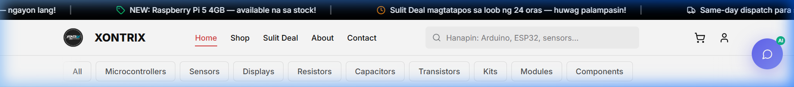
</p>
<p align="center"><em>Persistent top navigation bar with logo, search field, category links, cart badge, and user account menu.</em></p>
</details>

<details>
<summary><strong>🏠 Homepage — Hero Section</strong></summary>
<br/>
<p align="center">
  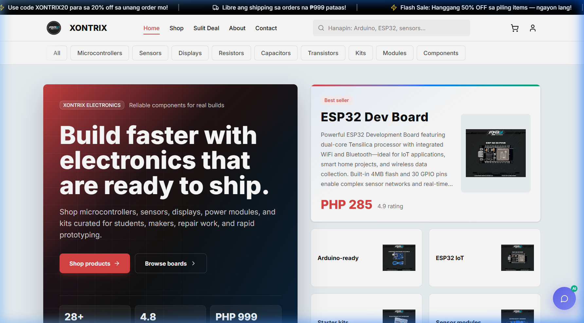
</p>
<p align="center"><em>Modern storefront hero featuring a full-width promo banner, headline copy, and a primary call-to-action to browse the catalog.</em></p>
</details>

<details>
<summary><strong>🏠 Homepage — Categories Section</strong></summary>
<br/>
<p align="center">
  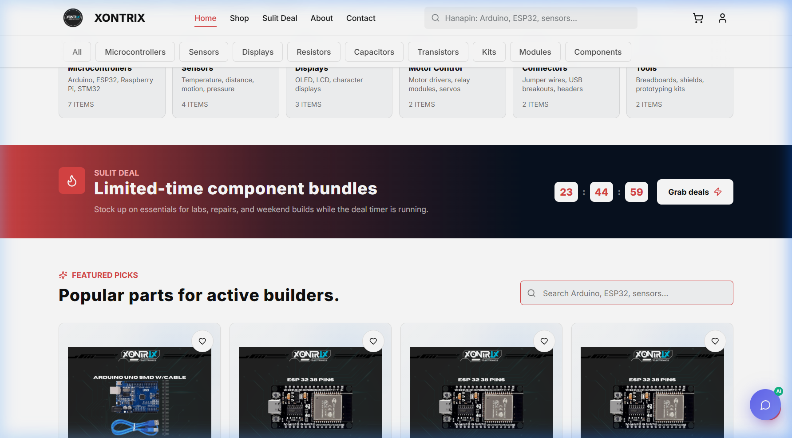
</p>
<p align="center"><em>Visual category grid showcasing all six electronics categories with icon cards and quick-navigate links.</em></p>
</details>

<details>
<summary><strong>🏠 Homepage — Universities &amp; Featured Sections</strong></summary>
<br/>
<p align="center">
  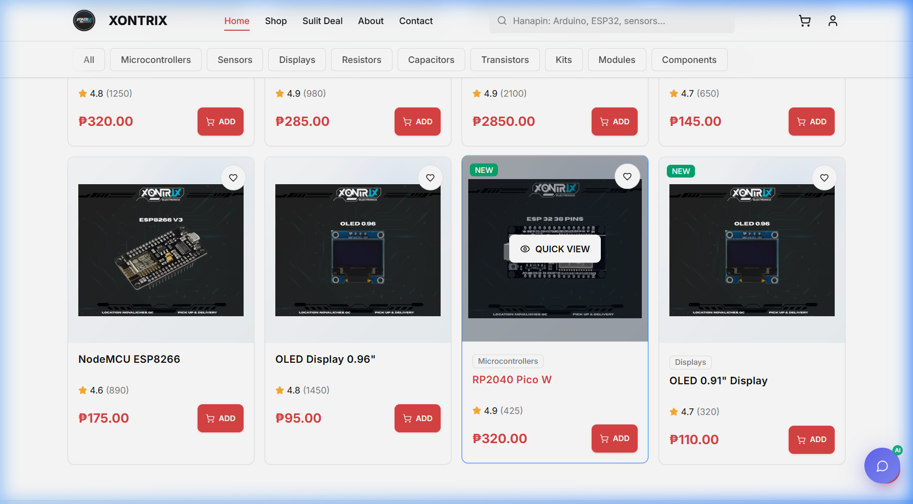
</p>
<p align="center"><em>Mid-page highlights including university partnerships, featured component picks, and promotional deal rows.</em></p>
</details>

<details>
<summary><strong>👣 Homepage Footer</strong></summary>
<br/>
<p align="center">
  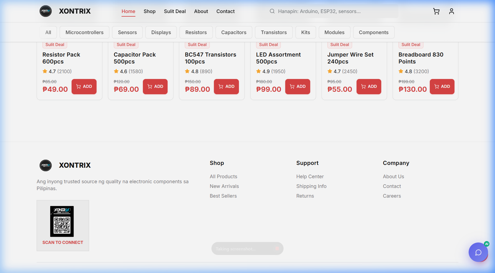
</p>
<p align="center"><em>Clean, descriptive footer layout listing store links, customer attributions, and design credits.</em></p>
</details>

<details>
<summary><strong>🛍️ Products Page — Catalog Listing</strong></summary>
<br/>
<p align="center">
  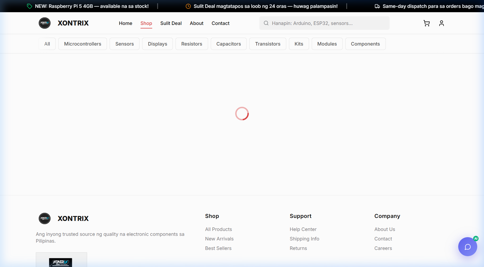
</p>
<p align="center"><em>Product catalog screen featuring category sidebar filters, search bar, item ratings, stock status, and add-to-cart actions.</em></p>
</details>

<details>
<summary><strong>🛍️ Products Page — Scrolled View</strong></summary>
<br/>
<p align="center">
  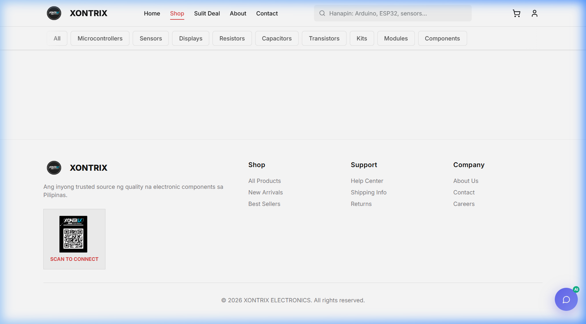
</p>
<p align="center"><em>Lower catalog section showing additional products with consistent card layout and badge indicators.</em></p>
</details>

<details>
<summary><strong>📦 Product Detail — Top View</strong></summary>
<br/>
<p align="center">
  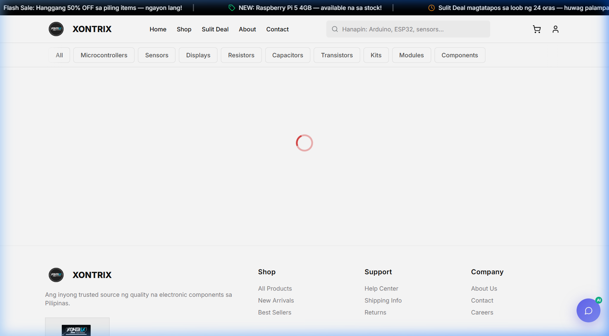
</p>
<p align="center"><em>Individual product page with high-res image, pricing, stock indicator, specification table, and add-to-cart controls.</em></p>
</details>

<details>
<summary><strong>📦 Product Detail — Scrolled View</strong></summary>
<br/>
<p align="center">
  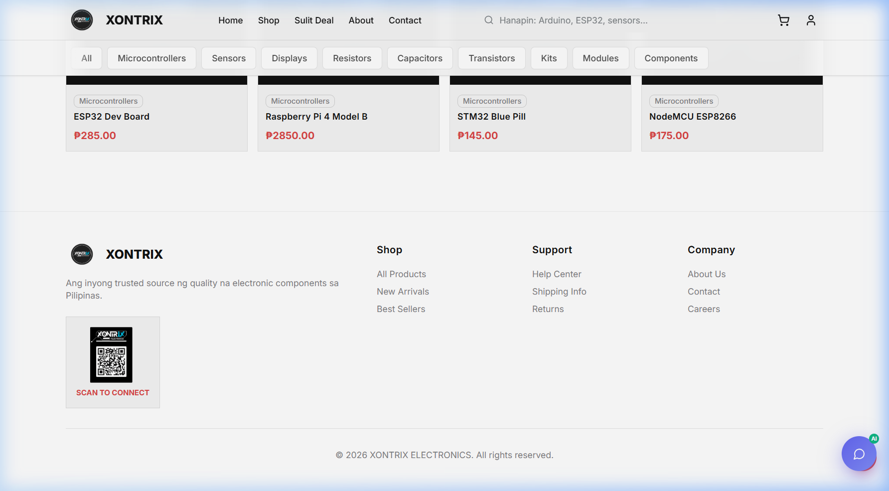
</p>
<p align="center"><em>Lower product detail area showing the full specifications breakdown, ratings summary, and customer reviews.</em></p>
</details>

<details>
<summary><strong>🛒 Cart — Empty State</strong></summary>
<br/>
<p align="center">
  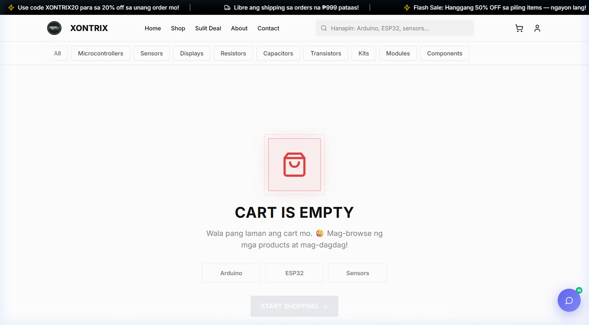
</p>
<p align="center"><em>Empty cart state with a friendly placeholder illustration and a call-to-action to continue browsing the catalog.</em></p>
</details>

<details>
<summary><strong>ℹ️ About Page — Top View</strong></summary>
<br/>
<p align="center">
  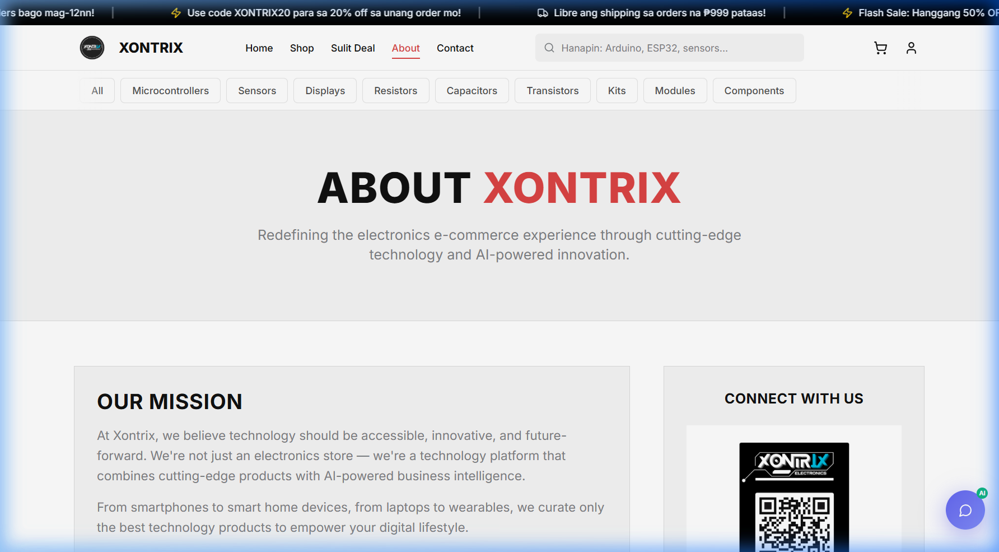
</p>
<p align="center"><em>Frosted-glass UI introducing the store's mission, quality standards, and core team overview.</em></p>
</details>

<details>
<summary><strong>ℹ️ About Page — Scrolled View</strong></summary>
<br/>
<p align="center">
  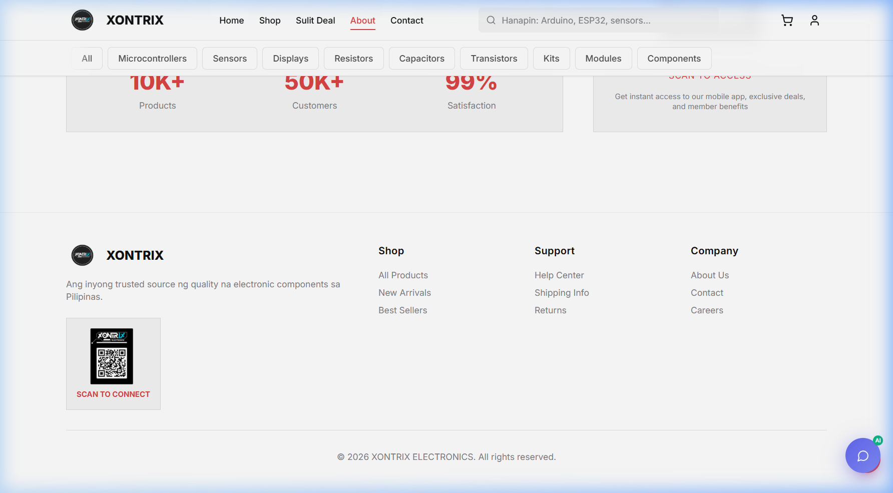
</p>
<p align="center"><em>Lower about section featuring technical partner attributions, community milestones, and social proof details.</em></p>
</details>

<details>
<summary><strong>📬 Contact Page</strong></summary>
<br/>
<p align="center">
  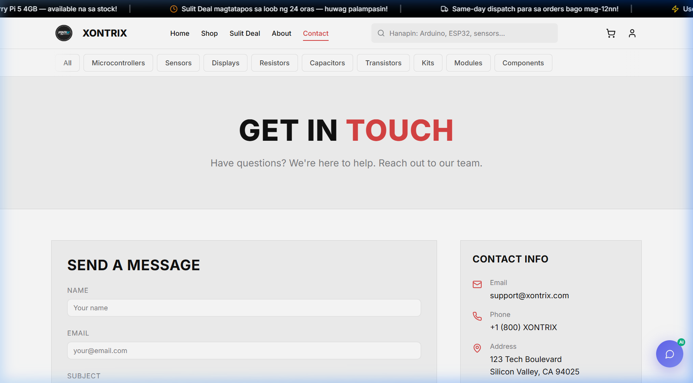
</p>
<p align="center"><em>Clean contact page with an interactive query form, customer support links, and office location details.</em></p>
</details>

<details>
<summary><strong>🔐 Login Page</strong></summary>
<br/>
<p align="center">
  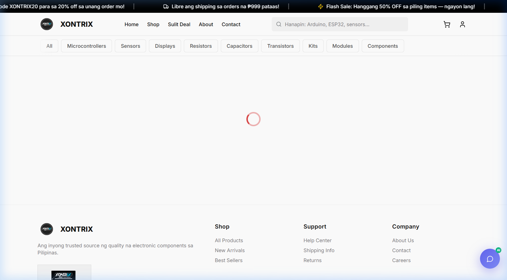
</p>
<p align="center"><em>Authentication page supporting standard email/password login and Google sign-in via Firebase OAuth flow.</em></p>
</details>

<details>
<summary><strong>🤖 Chatbot — Opened</strong></summary>
<br/>
<p align="center">
  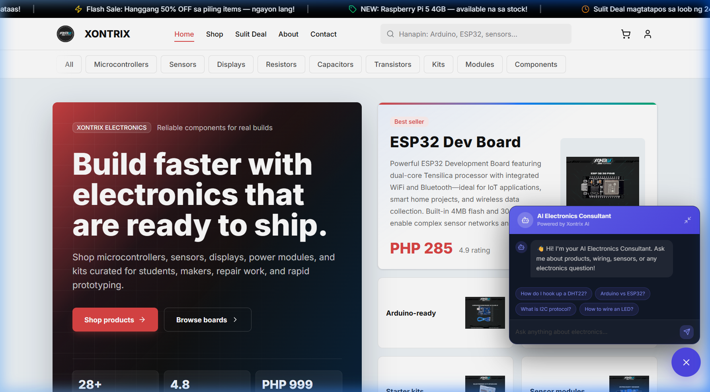
</p>
<p align="center"><em>AI Electronics Consultant floating widget opened, ready to assist users with product compatibility questions.</em></p>
</details>

<details>
<summary><strong>🤖 Chatbot — Active Conversation</strong></summary>
<br/>
<p align="center">
  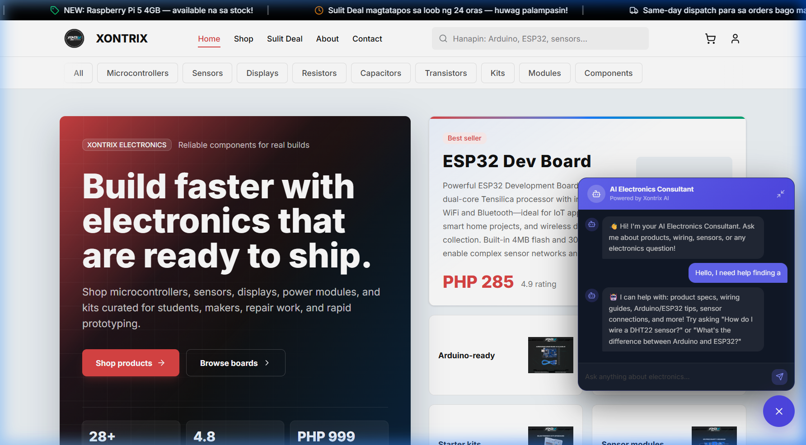
</p>
<p align="center"><em>Live chatbot session demonstrating context-aware recommendations for selecting compatible microcontrollers and sensors.</em></p>
</details>

<details>
<summary><strong>💳 Checkout Page</strong></summary>
<br/>
<p align="center">
  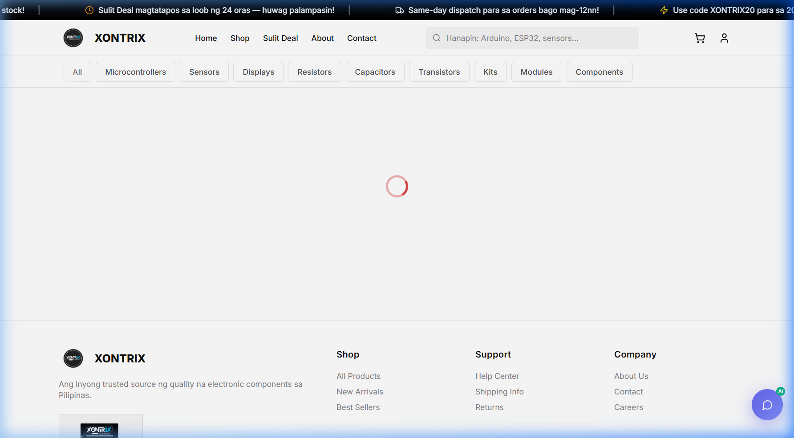
</p>
<p align="center"><em>Checkout layout showing order summary, shipping calculation, and multi-channel payment method options (GCash, Maya, COD, Card).</em></p>
</details>

<details>
<summary><strong>🚫 404 Not Found Page</strong></summary>
<br/>
<p align="center">
  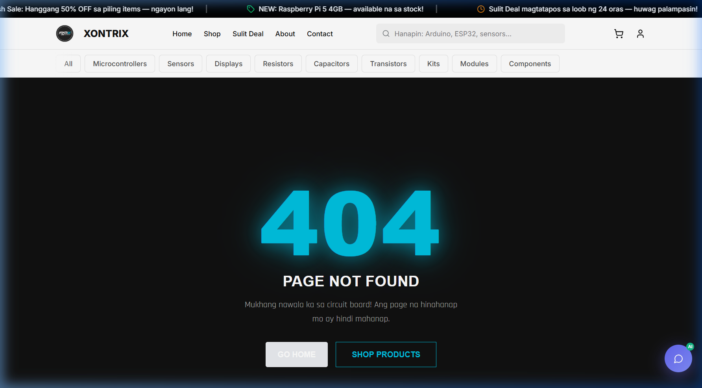
</p>
<p align="center"><em>Styled not-found page with navigation shortcuts to guide users back to the catalog or homepage.</em></p>
</details>

---

## ✨ Features

| Feature | Description |
|:--------|:------------|
| 🛒 **Product Catalog &amp; Filters** | Dynamic electronics catalog with category sorting, search, item ratings, reviews, stock labels, and new item flags. |
| 💳 **Flexible Checkout Flow** | Step-by-step transaction form supporting GCash, Maya, Cash on Delivery (COD), and credit card configurations. |
| 📦 **Real-Time Inventory Sync** | Automatic database checks that block purchases when quantities exceed stock, updating stock values on successful orders. |
| 📊 **Admin Sales Analytics** | Business Intelligence dashboard with charts, MoM growth metrics, targets, pending/shipped order states, and low-stock warnings. |
| 🤖 **AI Strategic Advisor** | Admin-side chatbot that scans sales metrics and historical feedback to generate financial advice. |
| 💬 **AI Electronics Consultant** | Customer-side floating chat widget that guides users on picking compatible microcontrollers and sensors. |
| 📅 **Delivery Order Calendar** | Dynamic calendar displaying shipping statuses, order delivery deadlines, and priority warnings. |
| 🏅 **Customer Loyalty Tiers** | Automatically places customers into Bronze, Silver, Gold, or Platinum tiers based on total spend and order counts. |
| 👤 **User Account Dashboard** | Full profile management with order history, saved addresses, wishlist, notifications, and security settings. |
| 🔐 **Multi-Auth Protocol** | Session-based login, JWT authentication via Node.js/Express auth server, and Google OAuth via Firebase Auth SDK. |
| 📱 **Cordova Mobile Wrapper** | Cordova project setup targeting Android platforms, allowing the web portal to be compiled into a native APK. |
| 🏗️ **PNPM Monorepo Layout** | Organized workspaces grouping the web app, auth server, PHP API backend, documentation, and mobile build wrappers. |

---

## 🏗️ Architecture

### System Architecture Diagram

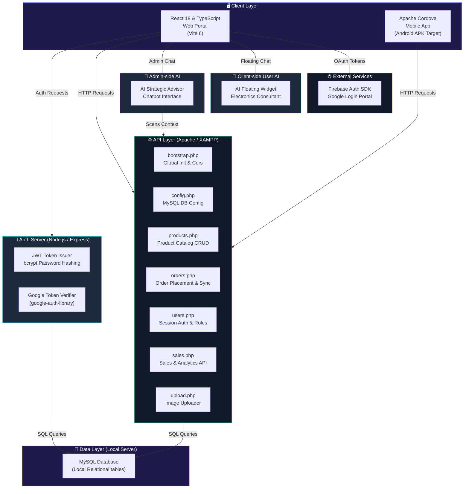
```mermaid
graph TB
    subgraph Client ["🖥️ Client Layer"]
        WEB["React 18 & TypeScript<br/>Web Portal<br/>(Vite 6)"]
        MOBILE["Apache Cordova<br/>Mobile App<br/>(Android APK Target)"]
    end

    subgraph AuthSrv ["🔐 Auth Server (Node.js / Express)"]
        JWT["JWT Token Issuer<br/>bcrypt Password Hashing"]
        GOOGLE["Google Token Verifier<br/>(google-auth-library)"]
    end

    subgraph API ["⚙️ API Layer (Apache / XAMPP)"]
        BOOTSTRAP["bootstrap.php<br/>Global Init & Cors"]
        CONFIG["config.php<br/>MySQL DB Config"]
        PRODUCTS["products.php<br/>Product Catalog CRUD"]
        ORDERS["orders.php<br/>Order Placement & Sync"]
        USERS["users.php<br/>Session Auth & Roles"]
        SALES["sales.php<br/>Sales & Analytics API"]
        UPLOAD["upload.php<br/>Image Uploader"]
    end

    subgraph Data ["💾 Data Layer (Local Server)"]
        MYSQL["MySQL Database<br/>(Local Relational tables)"]
    end

    subgraph Services ["🌐 External Services"]
        FIREBASE["Firebase Auth SDK<br/>Google Login Portal"]
    end

    subgraph UserAI ["💬 Client-side User AI"]
        CONSULTANT["AI Floating Widget<br/>Electronics Consultant"]
    end

    subgraph AdminAI ["🤖 Admin-side AI"]
        ADVISOR["AI Strategic Advisor<br/>Chatbot Interface"]
    end

    WEB -->|"HTTP Requests"| API
    WEB -->|"Auth Requests"| AuthSrv
    MOBILE -->|"HTTP Requests"| API
    WEB -->|"OAuth Tokens"| FIREBASE
    AuthSrv -->|"SQL Queries"| MYSQL
    API -->|"SQL Queries"| MYSQL
    WEB -->|"Floating Chat"| CONSULTANT
    WEB -->|"Admin Chat"| ADVISOR
    ADVISOR -->|"Scans Context"| API

    style Client fill:#1e1b4b,stroke:#818cf8,color:#f8fafc
    style AuthSrv fill:#1e293b,stroke:#22d3ee,color:#f8fafc
    style API fill:#111827,stroke:#10b981,color:#f8fafc
    style Data fill:#1e1b4b,stroke:#eab308,color:#f8fafc
    style Services fill:#111827,stroke:#f97316,color:#f8fafc
    style UserAI fill:#1e293b,stroke:#06b6d4,color:#f8fafc
    style AdminAI fill:#1e293b,stroke:#a855f7,color:#f8fafc
```

### Data Flow

```
User / Admin Interaction
  │
  ├─── [Products List / Catalog] ─→ productsApi.list() ──→ products.php ──→ MySQL (SELECT)
  │
  ├─── [Checkout Transaction] ────→ ordersApi.create() ──→ orders.php
  │                                                          ├──→ Check Stock Availability
  │                                                          ├──→ Deduct MySQL Inventory (UPDATE)
  │                                                          ├──→ Insert Order & Items (INSERT)
  │                                                          └──→ Return ApiOrder JSON
  │
  ├─── [Login / Register] ────────→ Auth Server (Express) ─→ JWT Token
  │                                                          ├──→ bcrypt password hash verify
  │                                                          ├──→ Google token validation
  │                                                          └──→ Return signed JWT cookie
  │
  ├─── [AI Strategic Advice] ─────→ Admin Dashboard ─────→ salesApi.summary() ──→ sales.php
  │                                                          ├──→ Compute financial KPIs
  │                                                          ├──→ Retrieve daily/weekly/monthly charts
  │                                                          └──→ Strategic advice prompt context
  │
  └─── [Google Authentication] ───→ Firebase Auth SDK ───→ Auth Server / users.php
                                                             ├──→ Create / Login User Record
                                                             └──→ Return Session Cookie
```

---

## 📐 Design Patterns

| Pattern | Usage | Details |
|:--------|:------|:--------|
| 🔀 **Monorepo Structure** | Workspace Layout | Manages multiple applications (frontend, auth server, backend, mobile) within a single codebase using `pnpm-workspace.yaml`. |
| 📋 **Model-View-Controller (MVC)** | Backend Routing | PHP controllers act as routers (Controllers), database queries represent data shapes (Models), and JSON outputs serve as views (Views). |
| 🧱 **Type-Safe Contracts** | API Interface Client | TypeScript interfaces in the web app mirror MySQL schema fields exactly, creating an end-to-end data contract. |
| 🔐 **JWT + Session Auth** | User Authentication | Combines a dedicated Node.js JWT auth server with PHP sessions, plus Firebase tokens for Google OAuth client flows. |
| 🛡️ **Guard / Policy Pattern** | Admin Route Protection | Middleware checks roles (e.g., admin role check) both in React Router (frontend) and on the PHP backend APIs (backend). |
| 🎣 **State Synchronization** | React Hooks &amp; Context | Syncs shopping cart state, session user profiles, and catalog cache across pages using React Context providers. |
| ⚙️ **Inventory Safety** | Optimistic Locking | Verifies quantity caps during cart updates and re-validates stock levels at the moment of checkout transaction. |
| 🤖 **Conversational Interface Agent** | UI Chat Widgets | Integrates floating conversational UI components leveraging context-aware responses to guide users and advise admins. |

---

## 🛠 Tech Stack

### 🎨 Frontend

| Technology | Purpose |
|:-----------|:--------|
|  | Component-based UI rendering, local state management, and virtual DOM diffing. |
|  | End-to-end type safety, auto-completion of API models, and compile-time error checks. |
|  | Bundle compiler, development server, dynamic hot module replacement, and environment configurations. |
|  | Responsive utilities, layouts, gradients, and custom components styling. |
|  | Modular accessible building components built on Radix UI primitives. |
|  | Custom interactive area and line charts for daily/weekly/monthly revenue tracking. |

### ⚙️ Backend

| Technology | Purpose |
|:-----------|:--------|
|  | Server-side script request routing, JSON generation, session management, and stock deduction. |
|  | Relational database engine storing products, user details, order lists, analytics, and feedback. |
|  | Dedicated auth server handling JWT issuance, bcrypt password hashing, and Google token verification. |
|  | Google sign-in provider SDK, handling client token flows for account login matching. |

### 🧰 Mobile &amp; Tooling

| Technology | Purpose |
|:-----------|:--------|
|  | Hybrid wrapper compilation to bundle Vite production assets into a native Android APK target. |
|  | Workspace package manager handling dependencies, workspace scripts, and monorepo orchestration. |

---

## ☁️ Services &amp; Environment Configuration

### Deployment Workflow

```
Workspace (Local Edit)
   │
   ├─── Web Assets Build ──→ pnpm build ──→ dist/ ──→ Deploy to Static Apache Root
   │
   ├─── Auth Server ───────→ node server.js (or nodemon) ──→ localhost:3001
   │
   ├─── Mobile APK Build ──→ cordova build android ──→ platforms/android/app/.../app-debug.apk
   │
   └─── Backend Setup ─────→ Copy apps/backend/xontrix-backend to htdocs/
                                 └─── Trigger db seeder install.php
```

### Service Roles

| # | Service | Role | Server / Local | Description |
|:-:|:--------|:-----|:---------------|:------------|
| 1 | **Apache HTTP Server** | Web API Host | Local (XAMPP) | Hosts the PHP controllers and assets, handling API routing calls. |
| 2 | **MySQL Database** | Relational Storage | Local (XAMPP) | Stores core entities: products, inventory, users, sales metrics, and logs. |
| 3 | **Node.js Auth Server** | JWT Authentication | Local (Express) | Handles password hashing, JWT token issuance, and Google token validation. |
| 4 | **Firebase Console** | Google Identity Provider | Cloud Service | Authenticates user clients and returns credentials for Google login sync. |
| 5 | **Cordova Android SDK** | APK Compiler | Local CLI | Wraps frontend files into native Android app package configurations. |

### Environment Configuration Reference

To let the frontend web portal communicate with the backend PHP endpoints, auth server, and Google Auth, create a `.env` file under `apps/web/` containing:

```env
# ── API Connection (XAMPP Local Server) ──
VITE_API_URL=http://localhost/xontrix-backend/api

# ── Auth Server Connection ──
VITE_AUTH_URL=http://localhost:3001

# ── Google Authentication (Firebase Console Setup) ──
VITE_FIREBASE_API_KEY=your_firebase_api_key_here
VITE_FIREBASE_AUTH_DOMAIN=your_project_id.firebaseapp.com
VITE_FIREBASE_PROJECT_ID=your_project_id
VITE_FIREBASE_STORAGE_BUCKET=your_project_id.appspot.com
VITE_FIREBASE_MESSAGING_SENDER_ID=your_messaging_sender_id
VITE_FIREBASE_APP_ID=your_firebase_app_id
```

---

## 🚀 Getting Started

### 📋 Prerequisites

Ensure you have the following software installed locally:

| Tool | Version | Link |
|:-----|:--------|:-----|
| 🟢 **Node.js** | `≥ 18.0` | [nodejs.org](https://nodejs.org/) |
| 📦 **pnpm** | `≥ 9.0` | [pnpm.io](https://pnpm.io/) |
| 🎛️ **XAMPP / WampServer** | Latest (PHP 8+, MySQL) | [apachefriends.org](https://www.apachefriends.org/) |
| 📱 **Android Studio / SDK** | Command Line Tools &amp; Gradle | [developer.android.com](https://developer.android.com/studio) |
| ☕ **Java JDK** | `17` | [oracle.com](https://www.oracle.com/java/) |

### ⚡ Local Project Setup

**1. Clone the repository**
```bash
git clone https://github.com/TechyElle/e-commerce_website.git
cd e-commerce_website
```

**2. Install dependencies**
```bash
pnpm install
```

**3. Configure the PHP / MySQL Backend (XAMPP)**
- Copy the folder `apps/backend/xontrix-backend` into your XAMPP htdocs directory:
  ```
  C:\xampp\htdocs\xontrix-backend
  ```
- Open XAMPP Control Panel and start **Apache** and **MySQL**.

**4. Generate &amp; Seed the Database**
- Open your browser and navigate once to:
  ```
  http://localhost/xontrix-backend/api/install.php
  ```
  This creates the tables defined in `schema.sql` and inserts mock electronics products, orders, and users.

**5. Start the Auth Server**
```bash
cd apps/auth-server
npm run dev
```
The auth server will be available at [http://localhost:3001](http://localhost:3001).

**6. Start the Frontend Web App**
- Ensure you have configured your `.env` file under `apps/web/`.
- From the monorepo root, launch the development server:
  ```bash
  pnpm dev
  ```
- Open [http://localhost:5173](http://localhost:5173) in your browser.

### 📱 Building the Mobile App (Android)

**1. Navigate to the Cordova workspace**
```bash
cd apps/mobile/cordova-mobile/
```

**2. Add the Android platform**
```bash
cordova platform add android
```

**3. Compile target APK**
```bash
cordova build android
```
- The output APK will be generated at:
  `platforms/android/app/build/outputs/apk/debug/app-debug.apk`

---

## 📡 API Reference

### PHP API — `http://localhost/xontrix-backend/api`

| Endpoint | Method | Description |
|:---------|:-------|:------------|
| `/products.php` | `GET` | List all products with optional category/search filters |
| `/products.php` | `POST / PUT / DELETE` | Admin product CRUD operations |
| `/orders.php` | `GET` | Retrieve orders list |
| `/orders.php` | `POST` | Place a new order with inventory deduction |
| `/users.php` | `GET / POST` | User session management and login |
| `/sales.php` | `GET` | Sales summary, revenue charts, and analytics KPIs |
| `/upload.php` | `POST` | Admin product image file upload |

### Auth Server — `http://localhost:3001`

| Endpoint | Method | Description |
|:---------|:-------|:------------|
| `/auth/register` | `POST` | Register a new user with bcrypt password hashing |
| `/auth/login` | `POST` | Login and receive a signed JWT token |
| `/auth/google` | `POST` | Verify Google token and return a JWT |

---

## 🗄️ Database Schema

The relational database (hosted locally on MySQL) is structured as follows:

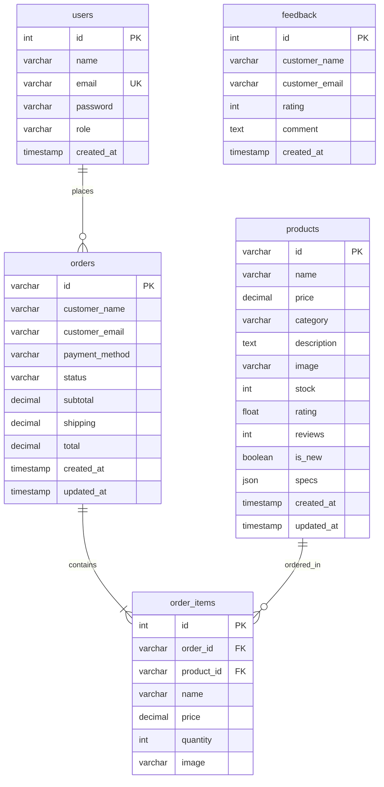
```mermaid
erDiagram
    users {
        int id PK
        varchar name
        varchar email UK
        varchar password
        varchar role
        timestamp created_at
    }

    products {
        varchar id PK
        varchar name
        decimal price
        varchar category
        text description
        varchar image
        int stock
        float rating
        int reviews
        boolean is_new
        json specs
        timestamp created_at
        timestamp updated_at
    }

    orders {
        varchar id PK
        varchar customer_name
        varchar customer_email
        varchar payment_method
        varchar status
        decimal subtotal
        decimal shipping
        decimal total
        timestamp created_at
        timestamp updated_at
    }

    order_items {
        int id PK
        varchar order_id FK
        varchar product_id FK
        varchar name
        decimal price
        int quantity
        varchar image
    }

    feedback {
        int id PK
        varchar customer_name
        varchar customer_email
        int rating
        text comment
        timestamp created_at
    }

    users ||--o{ orders : "places"
    orders ||--|{ order_items : "contains"
    products ||--o{ order_items : "ordered_in"
```

---

## 📁 Project Structure

```
.
├── 📂 apps/
│   ├── 🌐 web/                    # React 18 + Vite 6 + Tailwind 4 Frontend (→ Local Host)
│   │   ├── 📂 src/
│   │   │   ├── 📂 app/
│   │   │   │   ├── 📂 components/ # UI Components (shadcn/ui + custom widgets)
│   │   │   │   ├── 📂 context/    # React Contexts (AuthContext, CartContext, StoreContext)
│   │   │   │   ├── 📂 hooks/      # Custom React hooks (useScrollReveal)
│   │   │   │   ├── 📂 lib/        # API Client wrapper (api.ts)
│   │   │   │   ├── 📂 pages/      # Route pages:
│   │   │   │   │   ├── 📄 Home.tsx
│   │   │   │   │   ├── 📄 Products.tsx
│   │   │   │   │   ├── 📄 ProductDetail.tsx
│   │   │   │   │   ├── 📄 Cart.tsx
│   │   │   │   │   ├── 📄 Checkout.tsx
│   │   │   │   │   ├── 📄 About.tsx
│   │   │   │   │   ├── 📄 Contact.tsx
│   │   │   │   │   ├── 📄 Login.tsx
│   │   │   │   │   ├── 📄 Admin.tsx
│   │   │   │   │   ├── 📄 Dashboard.tsx
│   │   │   │   │   ├── 📄 UserProfile.tsx
│   │   │   │   │   ├── 📄 UserOrders.tsx
│   │   │   │   │   ├── 📄 UserWishlist.tsx
│   │   │   │   │   ├── 📄 UserAddresses.tsx
│   │   │   │   │   ├── 📄 UserNotifications.tsx
│   │   │   │   │   ├── 📄 UserSecurity.tsx
│   │   │   │   │   └── 📄 NotFound.tsx
│   │   │   │   ├── 📄 App.tsx     # Root app router provider
│   │   │   │   └── 📄 routes.tsx  # Dynamic router configuration
│   │   │   ├── 📂 imports/        # Image assets, logo, QR code
│   │   │   ├── 📂 styles/         # Globals.css containing Tailwind utility theme config
│   │   │   └── 📄 main.tsx        # React bootstrap entry point
│   │   ├── 📄 vite.config.ts      # Vite 6 compiler and proxy settings
│   │   └── 📄 package.json
│   │
│   ├── 🔐 auth-server/            # Node.js + Express JWT Auth Server (→ localhost:3001)
│   │   ├── 📄 server.js           # Express routes: /auth/register, /auth/login, /auth/google
│   │   ├── 📄 db.js               # MySQL2 connection pool
│   │   └── 📄 package.json
│   │
│   ├── ⚙️ backend/
│   │   └── 📂 xontrix-backend/    # PHP / MySQL API Server Application (→ Apache)
│   │       ├── 📂 api/
│   │       │   ├── 📄 bootstrap.php  # Global CORS and header setups
│   │       │   ├── 📄 config.php     # MySQL database credentials & PDO wrapper
│   │       │   ├── 📄 install.php    # Automatic table generation & dataset seeder
│   │       │   ├── 📄 orders.php     # Order CRUD and inventory deduct actions
│   │       │   ├── 📄 products.php   # Product catalog manager (CRUD API)
│   │       │   ├── 📄 sales.php      # Sales analytics summary & dashboard events API
│   │       │   ├── 📄 schema.sql     # Database schema structure dump
│   │       │   ├── 📄 upload.php     # File upload handlers for admin products
│   │       │   └── 📄 users.php      # Session registration, login, and roles
│   │       └── 📄 README.md          # Backend configuration instructions
│   │
│   └── 📱 mobile/
│       └── 📂 cordova-mobile/    # Apache Cordova Mobile wrapper configuration (→ APK)
│           ├── 📂 config.xml      # Cordova app configs (name, bundle id, permissions)
│           └── 📂 www/            # Compiled static files folder for Cordova builds
│
├── 📂 docs/
│   ├── 📂 planning/               # Architecture designs, planning checklists
│   ├── 📂 screenshots/            # 18 showcase screenshots of all pages
│   ├── 📄 Attributions.md         # Framework and asset attributions
│   ├── 📄 PRODUCTS.pdf            # PDF documentation on electronic products
│   ├── 📄 README.md               # Standard client setup guide
│   ├── 📄 task.md                 # AI sales feature implementation status
│   └── 📄 TODO.md                 # Project QA checklists
│
├── 📄 pnpm-workspace.yaml         # PNPM workspace configurations
├── 📄 pnpm-lock.yaml              # Lockfile
└── 📄 README.md                   # You are here!
```

---

## 🗂️ Product Categories

Xontrix organizes its electronic components catalog into **6 core product categories**:

| Icon | Category Name | Description &amp; Key Examples |
|:----:|:--------------|:---------------------------|
| 🧠 | **Microcontrollers** | Core processor units: Arduino Uno, ESP8266 NodeMCU, ESP32, Arduino Nano |
| 📡 | **Sensors** | Interaction modules: DHT11 Temp, MQ-2 Smoke, Ultrasonic HC-SR04, Soil Moisture |
| ⚙️ | **Actuators &amp; Motors** | Movement drivers: Stepper Motor, Servo Motor SG90, DC Gearbox Robot Motor |
| 🛡️ | **Shields &amp; Modules** | Expandable shield boards: Motor Driver L298N, RFID RC522, ESP8266 Expansion |
| 🔌 | **Accessories &amp; Cables** | Prototype tools: Breadboard, Jumper Wires, 5V Regulator LM7805, Logic ICs |
| 🔋 | **Power &amp; Switches** | Energy controllers: Rocker Switch 2-pin, 9V Battery Snap, Toggle buttons |

---

## 🗺️ Roadmap

- [x] Scaffolding monorepo layouts using PNPM workspaces
- [x] Implementing React storefront components catalog
- [x] Implementing PHP MySQL backend endpoints
- [x] Adding Node.js/Express JWT authentication server
- [x] Coding dynamic cart management cap-checked by available inventory
- [x] Writing auto-deduct SQL orders transaction triggers
- [x] Adding Firebase Google Auth SDK route configurations
- [x] Adding Admin sales analytics charts and calendar views
- [x] Designing strategic AI Advisor and user AI Consultant chatbot views
- [x] Building full user account dashboard (profile, orders, wishlist, addresses, notifications, security)
- [x] Building Cordova hybrid project configs to compile Android APK targets
- [ ] Integrating GCash and Maya real payment gateway merchant APIs
- [ ] Implementing real-time push notifications for delivery deadlines
- [ ] Setting up automated daily database backup scripts
- [ ] Adding multi-vendor admin access controls to `/admin` routes

---

## 🤝 Contributing

Contributions are what make the open-source community such an amazing place to learn, inspire, and create. Any contributions you make are **greatly appreciated**.

1. **Fork** the repository
2. **Create** your feature branch
   ```bash
   git checkout -b feat/amazing-feature
   ```
3. **Commit** your changes
   ```bash
   git commit -m "feat: add amazing feature"
   ```
4. **Push** to the branch
   ```bash
   git push origin feat/amazing-feature
   ```
5. **Open** a Pull Request

### 📝 Commit Convention

This project follows [Conventional Commits](https://www.conventionalcommits.org/):

| Prefix | Description |
|:-------|:------------|
| `feat:` | New feature |
| `fix:` | Bug fix |
| `docs:` | Documentation changes |
| `style:` | Code style (formatting, no logic change) |
| `refactor:` | Code refactoring |
| `test:` | Adding or updating tests |
| `chore:` | Maintenance tasks |

---

## 👥 Team

<table>
  <tr>
    <td align="center" width="33%">
      <strong>Ghani Regina Gold San Luis</strong><br/>
      <sub>Quality Assurance Engineer</sub>
    </td>
    <td align="center" width="33%">
      <strong>Cielle Mae Peñamora</strong><br/>
      <sub>Full-Stack Engineer</sub>
    </td>
    <td align="center" width="33%">
      <strong>Jayson Cris Mamaril</strong><br/>
      <sub>Mobile Engineer</sub>
    </td>
  </tr>
</table>

---

## 📄 License

This project is licensed under the **MIT License** — see the [LICENSE](LICENSE) file for details.

```
MIT License

Copyright (c) 2026 TechyElle | Ghani Regina Gold

Permission is hereby granted, free of charge, to any person obtaining a copy
of this software and associated documentation files (the "Software"), to deal
in the Software without restriction, including without limitation the rights
to use, copy, modify, merge, publish, distribute, sublicense, and/or sell
copies of the Software, and to permit persons to whom the Software is
furnished to do so, subject to the following conditions:

The above copyright notice and this permission notice shall be included in all
copies or substantial portions of the Software.

THE SOFTWARE IS PROVIDED "AS IS", WITHOUT WARRANTY OF ANY KIND, EXPRESS OR
IMPLIED, INCLUDING BUT NOT LIMITED TO THE WARRANTIES OF MERCHANTABILITY,
FITNESS FOR A PARTICULAR PURPOSE AND NONINFRINGEMENT. IN NO EVENT SHALL THE
AUTHORS OR COPYRIGHT HOLDERS BE LIABLE FOR ANY CLAIM, DAMAGES OR OTHER
LIABILITY, WHETHER IN AN ACTION OF CONTRACT, TORT OR OTHERWISE, ARISING FROM,
OUT OF OR IN CONNECTION WITH THE SOFTWARE OR THE USE OR OTHER DEALINGS IN THE
SOFTWARE.
```

---

## 🙏 Acknowledgements

- [React](https://react.dev/) — The library for web user interfaces
- [Vite](https://vite.dev/) — Next-generation frontend tooling
- [Tailwind CSS](https://tailwindcss.com/) — Utility-first CSS styling
- [PHP](https://www.php.net/) — Fast, general-purpose scripting language
- [MySQL](https://www.mysql.com/) — Relational database system
- [Express](https://expressjs.com/) — Fast, minimalist web framework for Node.js
- [Apache Cordova](https://cordova.apache.org/) — Mobile application development framework
- [Firebase Auth](https://firebase.google.com/docs/auth) — Google identity provider toolkit
- [Recharts](https://recharts.org/) — Redefined chart library for React applications
- [Lucide React](https://lucide.dev/) — Clean community-designed SVG icons
- [shadcn/ui](https://ui.shadcn.com/) — Premium accessible React component primitives

<p align="center">
  <strong>Built with 💡 for efficient electronics development</strong>
</p>

<p align="center">
  
  
  
  
  
</p>
